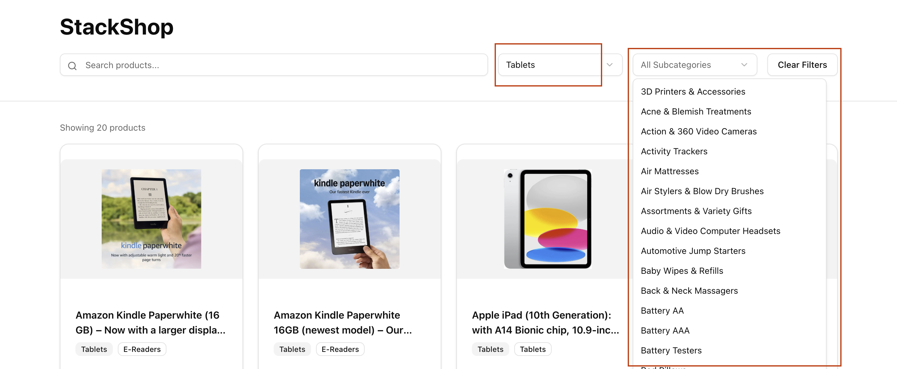
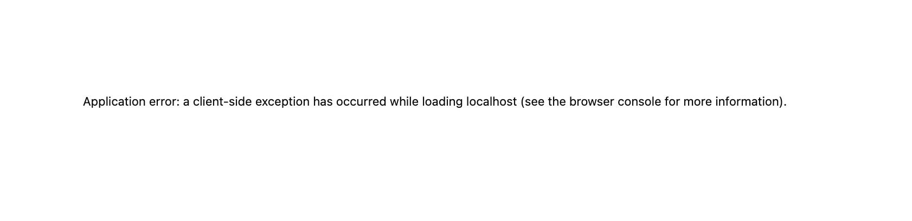
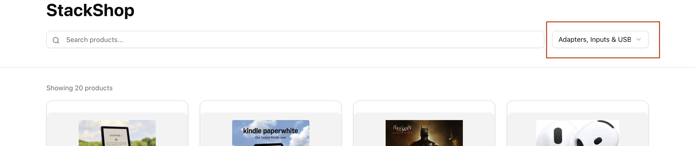
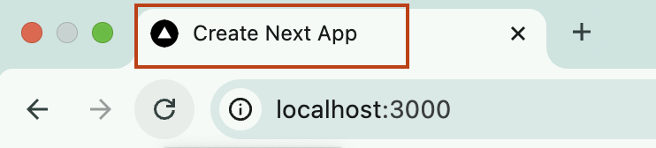
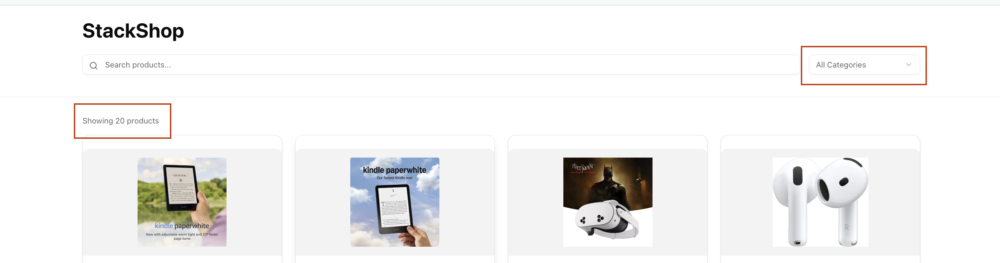
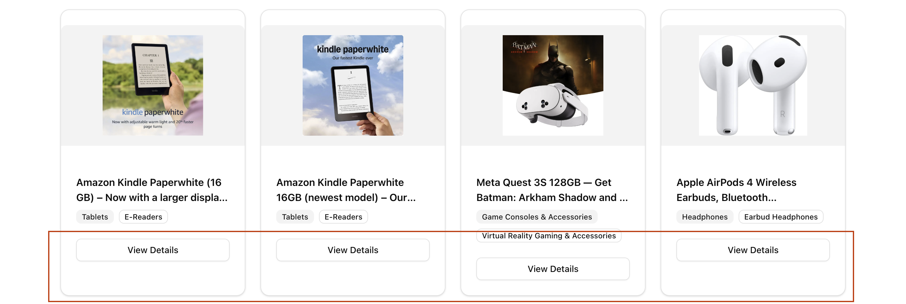
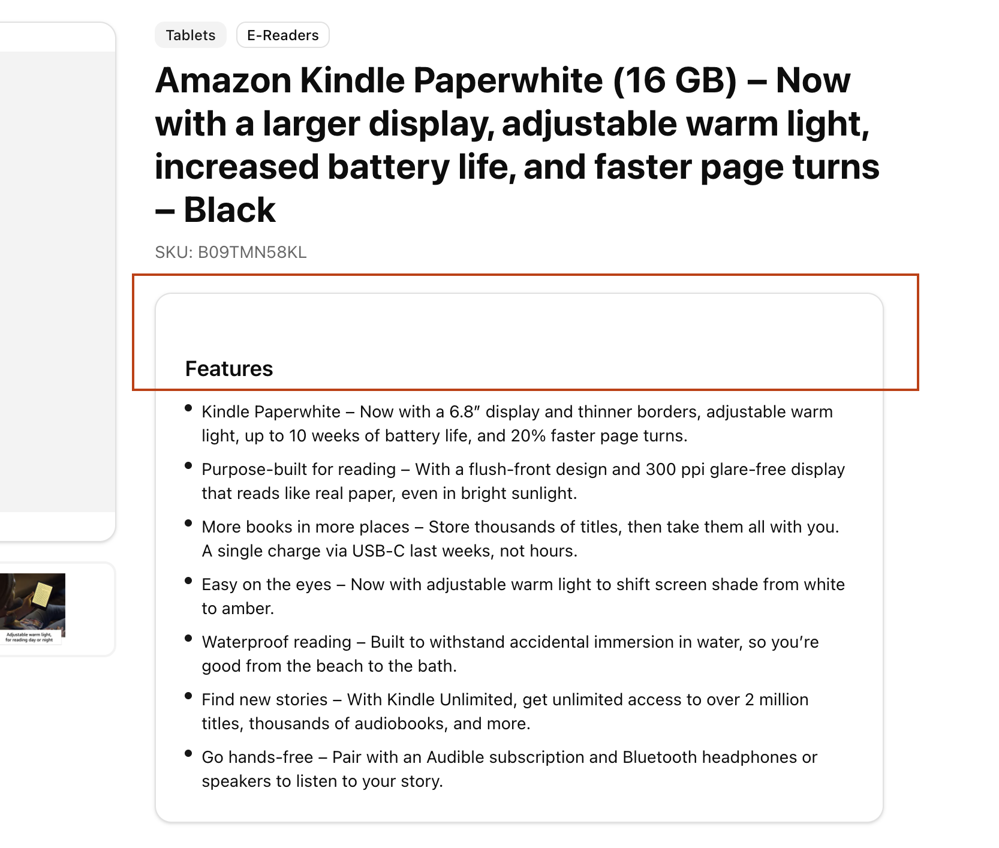

# Stackline Full Stack Assignment

## Table of Contents

- [Getting Started](#getting-started)
- [My Approach](#my-approach)
- [Bugs & Issues Fixed](#bugs-issues-fixed)
  - [Functionality](#functionality)
  - [UX](#ux)
  - [Design](#design)
- [Error Handling Improvements](#error-handling-improvements)
- [Summary](#summary)

---

<a id="getting-started"></a>
## Getting Started

```bash
yarn install
yarn dev
```

Open [http://localhost:3000](http://localhost:3000) to run the application.

---

<a id="my-approach"></a>
## My Approach

After receiving the codebase, I focused on understanding the application from a **user's perspective** before diving into code.

1. **Run and explore** — I installed dependencies, started the dev server, and used the app as a real user would: browsing the product list, using search, filtering by category and subcategory, opening product details, and clearing filters.
2. **Prioritize by impact** — I listed every issue that affected correctness or user experience. My priority was: *whatever we show to the user should work and feel consistent.*
3. **Fix, then document** — For each bug I fix, I add it to this document: what I saw, root cause, fix, and why. That way the README grows with the work and stays accurate.

Below, issues are **grouped by category**. Each bug’s full write-up is added here **after** it’s fixed. Where relevant, I include before fix screenshots.

---

<a id="bugs-issues-fixed"></a>
## Bugs & Issues Fixed

<a id="functionality"></a>
### Functionality

Issues that affected correct behavior or caused errors.

<a id="bug-1"></a>
#### 1. Subcategory dropdown showed same options for every category

**What I saw:** After selecting a category (e.g. "Tablets"), the subcategory dropdown appeared but listed subcategories from *all* categories, not just the selected one. This made filtering misleading.

**Screenshot:**  


**Root cause:** The frontend called `/api/subcategories` without passing the selected category. The API supports a `category` query parameter but never received it.

**Fix:** In `app/page.tsx`, in the `useEffect` that fetches subcategories, the request URL now includes the selected category:

```ts
fetch(`/api/subcategories?category=${encodeURIComponent(selectedCategory)}`)
```

**Why this approach:** The API was already built to filter by category; the fix was a single change on the client to use it. No API or data-layer changes required.

---

<a id="bug-2"></a>
#### 2. Runtime error when search returned no results (unconfigured image host)

**What I saw:** When searching for something that matched no products (e.g. typing "x"), or when products from the list used a different image host, the app threw a runtime error:  
`Invalid src prop ... hostname "images-na.ssl-images-amazon.com" is not configured under images in next.config.js`

**Screenshot:**  


**Root cause:** Some products in the sample data use images from `images-na.ssl-images-amazon.com`. Next.js `next/image` only allows hostnames listed in `next.config.ts`; only `m.media-amazon.com` was configured. When any product with those image URLs was rendered, the component threw.

**Fix:** In `next.config.ts`, added the second host to `images.remotePatterns`:

```ts
{
  protocol: 'https',
  hostname: 'images-na.ssl-images-amazon.com',
}
```

**Why this approach:** The data uses two Amazon image hosts; allowing the second one prevents the crash without changing the data.

**Enhancement — validation and fallback:** To handle any future or third-party image URLs whose host isn’t in `next.config`, I added a small validation layer so the app never crashes on an unknown host. In `lib/image-utils.ts`, an allowed-hosts list (kept in sync with `next.config` `remotePatterns`) and an `isAllowedImageUrl(url)` helper check the URL before we pass it to `next/image`. If the host isn’t allowed, we render a fallback (“Image unavailable”) instead of throwing. This is used on the product list and product detail pages so unknown image URLs show a safe fallback instead of a runtime error.

---

<a id="ux"></a>
### UX

Issues that affected user flow, clarity, or expectations.

<a id="bug-3"></a>
#### 3. After "Clear Filters", category dropdown still showed last selected value 

**What I saw:** Clicking "Clear Filters" correctly cleared the product results, but the category dropdown still displayed the previously selected category name instead of the placeholder "All Categories".

**Screenshot:**  


**Root cause:** The Select component was controlled with `value={selectedCategory}`. When we set `selectedCategory` to `undefined`, the Radix Select in this setup did not reliably show the placeholder again.

**Fix:** In `app/page.tsx`, both category and subcategory Selects now use an explicit empty string when no value is selected so the placeholder shows:

```ts
value={selectedCategory ?? ""}
value={selectedSubCategory ?? ""}
```

The existing `onValueChange` already maps empty string to `undefined` (`value || undefined`), so behavior stays correct.

**Why this approach:** Minimal change that matches how controlled Select components expect to represent "no selection" while still showing the placeholder.

---

<a id="bug-4"></a>
#### 4. Tab showed "Create Next App" and Next.js icon instead of app branding

**What I saw:** The browser tab showed the default Next.js favicon and the title "Create Next App" instead of the application name and app-specific branding.

**Screenshot:**  


**Root cause:** The root layout used the default Next.js `metadata` (title and description) from the template, and no custom favicon was set.

**Fix:** In `app/layout.tsx`, updated the exported `metadata` to use the app name and a short description:

```ts
export const metadata: Metadata = {
  title: "StackShop",
  description: "Sample eCommerce product browsing and search",
};
```

**Why this approach:** Metadata is the right place for document title and description in the Next.js App Router. For now only the title (and description) are changed; we don’t have a branding icon yet — once we have one, we can add it via `app/icon.png` or `app/favicon.ico` and the tab will show it. We can also add titles based on routes later (e.g. `metadata` or `generateMetadata` in each page or layout) so the tab shows context like "StackShop – Product Name" on the product detail page.

---

<a id="bug-5"></a>
#### 5. Product list showed only 20 products with no way to see more (misleading)

**What I saw:** With "All categories" selected, the list showed "Showing 20 products" and only 20 cards. There was no indication that more products existed and no way to view them, which was misleading.

**Screenshot:**  


**Root cause:** The API was called with `limit=20` and no `offset`; the UI displayed only the count of the current slice (`products.length`) and had no pagination.

**Fix:** In `app/page.tsx`:
- **Transparency:** The API returns `total`; the UI now shows **"Showing 1–20 of 150 products"** (or the current range) when there are more than 20 results so the user knows more exist.
- **Pagination:** Added page state and pass `offset=(page-1)*20` to the API. When there is more than one page, show **Previous / Next** buttons and **"Page X of Y"**. Users can also **type a page number** in an input and press Enter or blur to jump to that page (value is validated and clamped). Page resets to 1 when search or filters change.

**Why this approach:** Fixing the misleading UX required both making the total visible and giving users a way to access the rest of the results; pagination with a type-to-jump input keeps the 20-per-page limit (good for performance) while making the list complete and honest.

---

<a id="design"></a>
### Design

Issues that affected visual consistency or layout.

<a id="bug-6"></a>
#### 6. Product list cards had inconsistent height (View Details button not aligned)

**What I saw:** Product cards in the grid had different heights because the "View Details" button sat right under the content. Cards with longer titles or more badges pushed the button down, making the grid look uneven.

**Screenshot:**  


**Root cause:** The card content (title, badges) had variable height, and the footer was not pinned to the bottom of the card.

**Fix:** In `app/page.tsx`, made the card content grow and the footer stick to the bottom so all cards in the grid align:

- **CardContent:** Added `flex-1 min-h-0` so the middle section takes up remaining space and the footer is pushed down. `min-h-0` allows the flex child to shrink so content doesn’t overflow.
- **CardFooter:** Added `mt-auto` so the footer stays at the bottom of the card.

The Card already had `flex flex-col h-full`, so no change there.

**Why this approach:** Standard flex pattern for equal-height cards in a grid; no layout rework, just alignment so the "View Details" button lines up across all cards.

---

<a id="bug-7"></a>
#### 7. Product detail — Features section had uneven padding above the heading

**What I saw:** On the product detail page, the "Features" card had a large gap above the "Features" heading compared to the left edge and the top border of the card, so the spacing felt inconsistent.

**Screenshot:**  


**Root cause:** The `Card` component applies `py-6` (top and bottom padding). The Features block also gave `CardContent` a `pt-6` class, so the top had double padding while the sides only had `px-6`.

**Fix:** In `app/product/page.tsx`, removed the extra top padding on the Features card so one source controls vertical spacing: `CardContent` now uses `className="px-6"` only (no `pt-6`). The Card’s built-in `py-6` provides even top and bottom spacing. Also added a defensive check `product.featureBullets?.length` so the section doesn’t break if `featureBullets` is missing.

**Why this approach:** A single source of padding for the card keeps all sides consistent without changing the shared Card component’s default behavior elsewhere.

---

<a id="error-handling-improvements"></a>
## Error Handling Improvements

While fixing the above, I improved error handling so the app doesn’t get stuck or leave the user without feedback when something fails:

- **List page API calls** — The product list, categories, and subcategories fetches had no `.catch()`. If an API failed, `loading` could stay `true` indefinitely. I added `.catch()` to all three: categories and subcategories fall back to empty arrays so the dropdowns still render; the products fetch sets `loading` to false, clears the list, and shows an error message (“Could not load products. Please try again.”). I also check `res.ok` on the products response so non-2xx responses are treated as failures.
- **Product detail** — The detail page currently reads product data from the URL (no API call). If the app is later updated to load by SKU from the API, 404 and network errors should be handled so the user sees “Product not found” or “Something went wrong” instead of a blank or stuck screen.

---

<a id="summary"></a>
## Summary

Quick reference by category.

| Category | # | Issue |
|----------|---|--------|
| **Functionality** | [1](#bug-1) | Subcategory dropdown same for every category |
| | [2](#bug-2) | Image host not configured → runtime error |
| **UX** | [3](#bug-3) | Clear Filters — category dropdown label not reset |
| | [4](#bug-4) | Tab title and icon not app-specific |
| | [5](#bug-5) | Product list showed only 20 products, no way to see more (misleading) |
| **Design** | [6](#bug-6) | Product cards inconsistent height |
| | [7](#bug-7) | Features heading padding on product detail |

